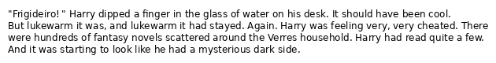

# TextToImage
A simple python script to convert any text to an image.


## Usage
```
A program to generate an image from a given text. Text can be provided either by a textfile or STDIN. [-h] [-i INPUT_FILE] [-o OUTPUT] [-s FONT_SIZE] [-m MARGIN] [-f FONT_PATH] [-w WIDTH]

optional arguments:
  -h, --help            show this help message and exit
  -i INPUT_FILE, --input-file INPUT_FILE
                        Filename from which the text shall be read. If no file is specified, than STDIN is assumed.
  -o OUTPUT, --output OUTPUT
                        Sets the filename of the output image.
  -s FONT_SIZE, --font-size FONT_SIZE
                        Sets the font size to be used to generate the image.
  -m MARGIN, --margin MARGIN
                        Sets the margin between the image-border and the text.
  -f FONT_PATH, --font-path FONT_PATH
                        Sets the path to the true-type-font (.ttf) that shall be used to generate the image. Default is the provided DejaVuSans.
  -w WIDTH, --width WIDTH
                        Sets the character width per line. Aka. how many characters shall be displayed for each line.
```

## Installation
- create virtual environment with *virtualenv*
    - `python3 -m virtualenv env`
- activate virtual environment
    - `source env/bin/activate`
- download required packages
    - `pip3 -r requirements.txt`

## Example

